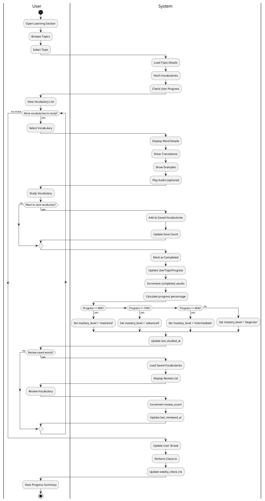
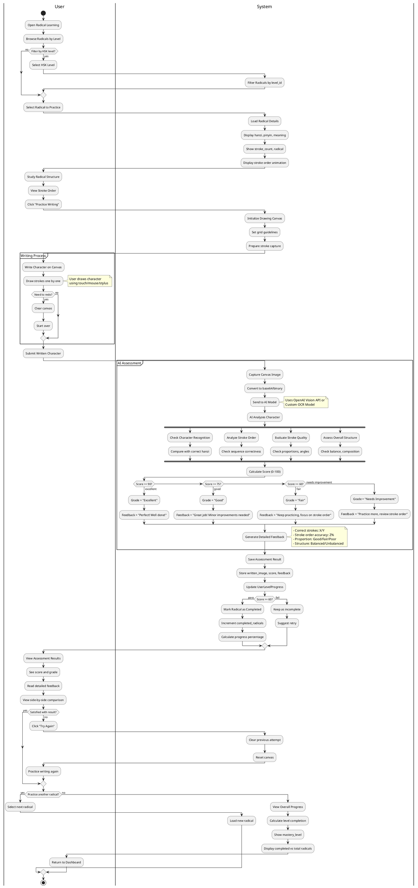
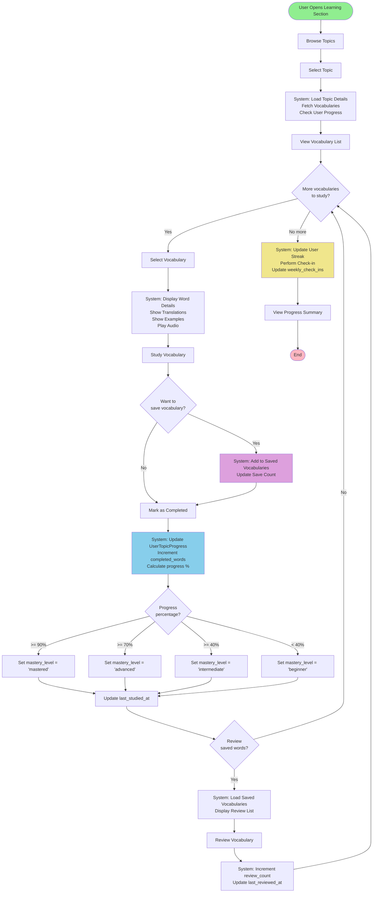

```plantuml
@startuml Taking Exam

|User|
start
:Open Exam Section;

:Browse Available Exams;

if (Filter by level?) then (yes)
  :Select HSK Level;
  |System|
  :Filter Exams by Level;
else (no)
endif

|User|
:Select Exam;

|System|
:Check Exam is_active;

if (Exam is active?) then (yes)
  :Load Exam Details;
  :Load Exam Parts;
  :Load Questions;
else (no)
  |User|
  :Show "Exam not available";
  stop
endif

|User|
:Review Exam Info;
:Click "Start Exam";

|System|
:Create UserExamAttempt;
:Set status = 'in_progress';
:Record started_at;
:Initialize timer;

|User|
partition "Listening Part" {
  while (More listening questions?) is (yes)
    |System|
    :Display Question;
    :Play Audio (if applicable);
    :Show Answer Options;
    
    |User|
    :Listen to Audio;
    :Select Answer;
    
    |System|
    :Record UserAnswer;
    :Save user_answer;
    :Record answered_at;
  endwhile (complete)
}

partition "Reading Part" {
  while (More reading questions?) is (yes)
    |System|
    :Display Question Text;
    :Show Answer Options;
    
    |User|
    :Read Question;
    :Select Answer;
    
    |System|
    :Record UserAnswer;
    :Save user_answer;
    :Record answered_at;
  endwhile (complete)
}

|User|
if (Review answers?) then (yes)
  :Navigate back to questions;
  :Change answers if needed;
  
  |System|
  :Update UserAnswer records;
else (no)
endif

:Click "Submit Exam";

|System|
:Stop timer;
:Calculate time_spent;

partition "Scoring Process" {
  :Initialize total_score = 0;
  
  while (For each UserAnswer) is (more)
    :Get QuestionContent;
    :Get correct_answers;
    :Compare user_answer with correct_answers;
    
    if (Answer is correct?) then (yes)
      :Set is_correct = true;
      :Set score_earned = question_score;
    else (no)
      :Set is_correct = false;
      :Set score_earned = 0;
    endif
    
    :Update UserAnswer;
    :Add score_earned to total_score;
  endwhile (done)
  
  :Calculate percentage;
  :percentage = (total_score / max_score) * 100;
}

:Update UserExamAttempt;
:Set completed_at = now();
:Set status = 'completed';
:Save total_score, percentage;

|User|
:View Exam Results;
:See score and percentage;

if (View detailed results?) then (yes)
  |System|
  :Show all questions;
  :Show user answers;
  :Show correct answers;
  :Display explanations;
  
  |User|
  :Review mistakes;
  :Read explanations;
else (no)
endif

:Return to Dashboard;

stop

@enduml
```

```mermaid
flowchart TD
    Start([User Opens Exam Section]) --> Browse[Browse Available Exams]
    Browse --> FilterQ{Filter<br/>by level?}
    FilterQ -->|Yes| SelectLevel[Select HSK Level]
    SelectLevel --> FilterSystem[System: Filter Exams by Level]
    FilterSystem --> SelectExam
    FilterQ -->|No| SelectExam[Select Exam]
    
    SelectExam --> CheckActive[System: Check Exam is_active]
    CheckActive --> IsActive{Exam<br/>is active?}
    IsActive -->|No| ShowError[Show 'Exam not available']
    ShowError --> EndError([End])
    IsActive -->|Yes| LoadExam[System: Load Exam Details<br/>Load Exam Parts<br/>Load Questions]
    
    LoadExam --> ReviewInfo[Review Exam Info]
    ReviewInfo --> StartExam[Click 'Start Exam']
    StartExam --> CreateAttempt[System: Create UserExamAttempt<br/>Set status = 'in_progress'<br/>Record started_at<br/>Initialize timer]
    
    CreateAttempt --> ListeningPart[=== LISTENING PART ===]
    ListeningPart --> MoreListening{More listening<br/>questions?}
    MoreListening -->|Yes| ShowListening[System: Display Question<br/>Play Audio<br/>Show Answer Options]
    ShowListening --> ListenAnswer[Listen to Audio<br/>Select Answer]
    ListenAnswer --> RecordListening[System: Record UserAnswer<br/>Save user_answer<br/>Record answered_at]
    RecordListening --> MoreListening
    
    MoreListening -->|Complete| ReadingPart[=== READING PART ===]
    ReadingPart --> MoreReading{More reading<br/>questions?}
    MoreReading -->|Yes| ShowReading[System: Display Question Text<br/>Show Answer Options]
    ShowReading --> ReadAnswer[Read Question<br/>Select Answer]
    ReadAnswer --> RecordReading[System: Record UserAnswer<br/>Save user_answer<br/>Record answered_at]
    RecordReading --> MoreReading
    
    MoreReading -->|Complete| ReviewAnswers{Review<br/>answers?}
    ReviewAnswers -->|Yes| NavigateBack[Navigate back to questions<br/>Change answers if needed]
    NavigateBack --> UpdateAnswers[System: Update UserAnswer records]
    UpdateAnswers --> SubmitExam
    ReviewAnswers -->|No| SubmitExam[Click 'Submit Exam']
    
    SubmitExam --> StopTimer[System: Stop timer<br/>Calculate time_spent]
    StopTimer --> ScoringStart[=== SCORING PROCESS ===]
    
    ScoringStart --> InitScore[Initialize total_score = 0]
    InitScore --> ForEachAnswer{For each<br/>UserAnswer}
    ForEachAnswer -->|More| GetContent[Get QuestionContent<br/>Get correct_answers<br/>Compare with user_answer]
    
    GetContent --> IsCorrect{Answer<br/>is correct?}
    IsCorrect -->|Yes| SetCorrect[Set is_correct = true<br/>Set score_earned = question_score]
    IsCorrect -->|No| SetWrong[Set is_correct = false<br/>Set score_earned = 0]
    
    SetCorrect --> UpdateAnswer[Update UserAnswer<br/>Add score_earned to total_score]
    SetWrong --> UpdateAnswer
    UpdateAnswer --> ForEachAnswer
    
    ForEachAnswer -->|Done| CalcPercentage[Calculate percentage<br/>percentage = total_score / max_score × 100]
    CalcPercentage --> UpdateAttempt[Update UserExamAttempt<br/>Set completed_at = now<br/>Set status = 'completed'<br/>Save total_score, percentage]
    
    UpdateAttempt --> ViewResults[View Exam Results<br/>See score and percentage]
    ViewResults --> ViewDetailed{View detailed<br/>results?}
    ViewDetailed -->|Yes| ShowDetailed[System: Show all questions<br/>Show user answers<br/>Show correct answers<br/>Display explanations]
    ShowDetailed --> ReviewMistakes[Review mistakes<br/>Read explanations]
    ReviewMistakes --> ReturnDash
    ViewDetailed -->|No| ReturnDash[Return to Dashboard]
    
    ReturnDash --> End([End])
    
    style Start fill:#90EE90
    style End fill:#FFB6C1
    style EndError fill:#FFB6C1
    style CreateAttempt fill:#87CEEB
    style ScoringStart fill:#FFD700
    style UpdateAttempt fill:#DDA0DD
```

```mermaid
flowchart TD
    Start([User Opens Radical Learning]) --> BrowseRadical[Browse Radicals by Level]
    BrowseRadical --> FilterLevel{Filter by<br/>HSK level?}
    FilterLevel -->|Yes| SelectHSK[Select HSK Level]
    SelectHSK --> FilterRadicals[System: Filter Radicals by level_id]
    FilterRadicals --> SelectRadical
    FilterLevel -->|No| SelectRadical[Select Radical to Practice]
    
    SelectRadical --> LoadRadical[System: Load Radical Details<br/>Display hanzi, pinyin, meaning<br/>Show stroke_count, radical<br/>Display stroke order animation]
    
    LoadRadical --> StudyRadical[Study Radical Structure<br/>View Stroke Order]
    StudyRadical --> ClickPractice[Click 'Practice Writing']
    
    ClickPractice --> InitCanvas[System: Initialize Drawing Canvas<br/>Set grid guidelines<br/>Prepare stroke capture]
    
    InitCanvas --> WriteChar[Write Character on Canvas<br/>Draw strokes one by one]
    WriteChar --> NeedRedo{Need to<br/>redo?}
    NeedRedo -->|Yes| ClearCanvas[Clear canvas<br/>Start over]
    ClearCanvas --> WriteChar
    NeedRedo -->|No| SubmitChar[Submit Written Character]
    
    SubmitChar --> AIStart[=== AI ASSESSMENT ===]
    AIStart --> CaptureImage[System: Capture Canvas Image<br/>Convert to base64/binary]
    CaptureImage --> SendAI[Send to AI Model<br/>OpenAI Vision API / Custom OCR]
    
    SendAI --> AnalyzeChar[AI Analyzes Character]
    AnalyzeChar --> CheckRecog[Check Character Recognition<br/>Compare with correct hanzi]
    AnalyzeChar --> CheckStroke[Analyze Stroke Order<br/>Check sequence correctness]
    AnalyzeChar --> CheckQuality[Evaluate Stroke Quality<br/>Check proportions, angles]
    AnalyzeChar --> CheckStructure[Assess Overall Structure<br/>Check balance, composition]
    
    CheckRecog --> CalcScore
    CheckStroke --> CalcScore
    CheckQuality --> CalcScore
    CheckStructure --> CalcScore[Calculate Score 0-100]
    
    CalcScore --> ScoreRange{Score<br/>range?}
    ScoreRange -->|>= 90| Excellent[Grade = 'Excellent'<br/>Feedback = 'Perfect! Well done!']
    ScoreRange -->|>= 75| Good[Grade = 'Good'<br/>Feedback = 'Great job! Minor improvements']
    ScoreRange -->|>= 60| Fair[Grade = 'Fair'<br/>Feedback = 'Keep practicing, focus on stroke order']
    ScoreRange -->|< 60| NeedImprove[Grade = 'Needs Improvement'<br/>Feedback = 'Practice more, review stroke order']
    
    Excellent --> GenFeedback
    Good --> GenFeedback
    Fair --> GenFeedback
    NeedImprove --> GenFeedback[Generate Detailed Feedback<br/>- Correct strokes: X/Y<br/>- Stroke order accuracy: Z%<br/>- Proportion: Good/Fair/Poor<br/>- Structure: Balanced/Unbalanced]
    
    GenFeedback --> SaveResult[Save Assessment Result<br/>Store written_image, score, feedback<br/>Update UserLevelProgress]
    
    SaveResult --> PassCheck{Score >= 60?}
    PassCheck -->|Pass| MarkComplete[Mark Radical as Completed<br/>Increment completed_radicals<br/>Calculate progress %]
    PassCheck -->|Fail| KeepIncomplete[Keep as incomplete<br/>Suggest retry]
    
    MarkComplete --> ViewResult
    KeepIncomplete --> ViewResult[View Assessment Results<br/>See score and grade<br/>Read detailed feedback<br/>View side-by-side comparison]
    
    ViewResult --> Satisfied{Satisfied<br/>with result?}
    Satisfied -->|No| TryAgain[Click 'Try Again']
    TryAgain --> ResetCanvas[System: Clear previous attempt<br/>Reset canvas]
    ResetCanvas --> WriteChar
    
    Satisfied -->|Yes| AnotherRadical{Practice<br/>another radical?}
    AnotherRadical -->|Yes| SelectNext[Select next radical]
    SelectNext --> LoadNext[System: Load new radical]
    LoadNext --> StudyRadical
    
    AnotherRadical -->|No| ViewOverall[View Overall Progress]
    ViewOverall --> CalcCompletion[System: Calculate level completion<br/>Show mastery_level<br/>Display completed vs total radicals]
    CalcCompletion --> ReturnDash[Return to Dashboard]
    
    ReturnDash --> End([End])
    
    style Start fill:#90EE90
    style End fill:#FFB6C1
    style AIStart fill:#FFD700
    style SendAI fill:#87CEEB
    style CalcScore fill:#DDA0DD
    style SaveResult fill:#F0E68C
```

# Activity Diagram - Chinese Learning Platform

## Main Features Activity Flows

### 1. Vocabulary Learning (Học từ vựng)
### 2. Taking Exam (Làm bài thi)
### 3. Radical Character Writing Assessment (Chấm điểm viết Radical)

---

## PlantUML Diagrams

### 1. Vocabulary Learning Flow

### 2. Taking Exam Flow

### 3. Radical Character Writing Assessment Flow

---

## Mermaid Diagrams

### 1. Vocabulary Learning Flow

### 2. Taking Exam Flow

### 3. Radical Character Writing Assessment Flow

---

## Giải thích các luồng

### 1. Vocabulary Learning (Học từ vựng)
- **Input**: User chọn Topic
- **Process**: 
  - Xem danh sách từ vựng
  - Học từng từ với translations, examples, audio
  - Lưu từ yêu thích (optional)
  - Đánh dấu hoàn thành
  - Hệ thống tự động cập nhật progress và mastery level
  - Review từ đã lưu
- **Output**: 
  - UserTopicProgress được cập nhật
  - Streak được ghi nhận
  - Progress summary

### 2. Taking Exam (Làm bài thi)
- **Input**: User chọn Exam
- **Process**:
  - Kiểm tra exam còn active
  - Tạo UserExamAttempt mới
  - Làm từng phần: Listening → Reading
  - Ghi nhận câu trả lời theo thời gian thực
  - Review và sửa đổi câu trả lời (optional)
  - Submit exam
  - Hệ thống chấm điểm tự động
  - So sánh user_answer với correct_answers
  - Tính tổng điểm và phần trăm
- **Output**:
  - UserExamAttempt với status = 'completed'
  - Tất cả UserAnswers với is_correct và score_earned
  - Kết quả chi tiết với explanations

### 3. Radical Character Writing Assessment (Chấm điểm viết Radical)
- **Input**: User chọn Radical và viết trên canvas
- **Process**:
  - Hiển thị radical details và stroke order animation
  - User vẽ character trên canvas
  - Capture canvas image
  - Gửi đến AI model (OpenAI Vision/Custom OCR)
  - AI phân tích 4 tiêu chí:
    - Character Recognition (nhận dạng chữ)
    - Stroke Order (thứ tự nét)
    - Stroke Quality (chất lượng nét)
    - Overall Structure (cấu trúc tổng thể)
  - Tính điểm 0-100 và grade
  - Tạo detailed feedback
  - Cập nhật UserLevelProgress nếu pass (>= 60)
- **Output**:
  - Assessment result với score, grade, feedback
  - UserLevelProgress được cập nhật
  - User có thể retry hoặc practice radical khác

## Notes
- Tất cả 3 luồng đều có error handling và validation
- Progress được tự động tính toán dựa trên completed/total
- Mastery levels: beginner (0-39%), intermediate (40-69%), advanced (70-89%), mastered (90-100%)
- AI assessment sử dụng multiple criteria để đánh giá chính xác
