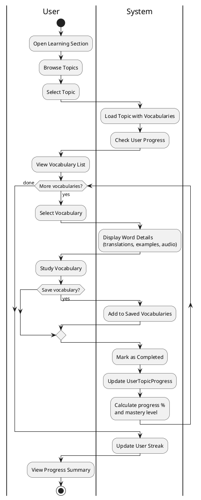
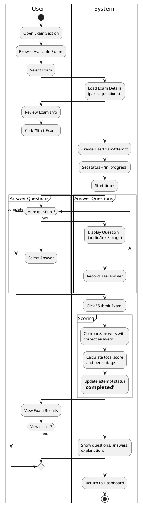
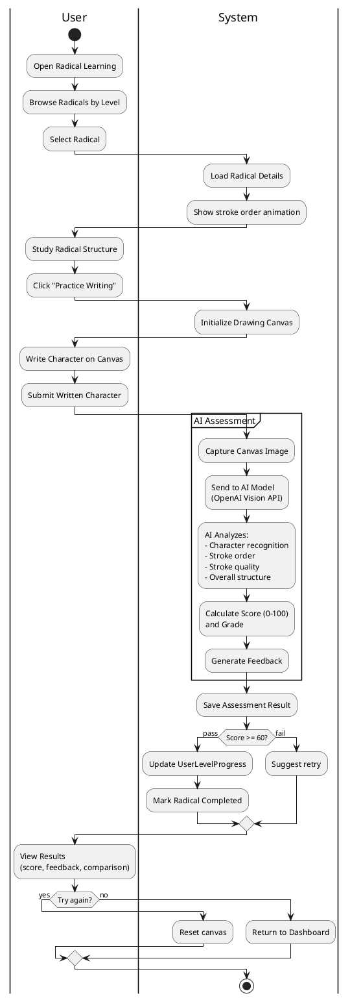
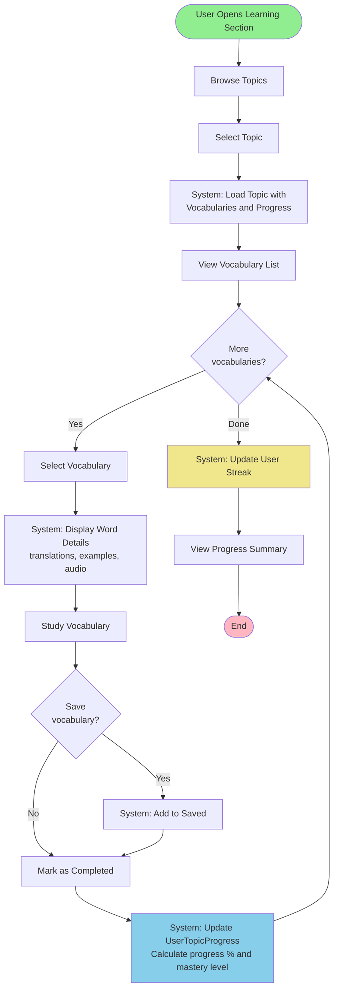
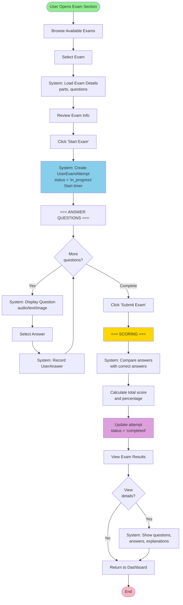
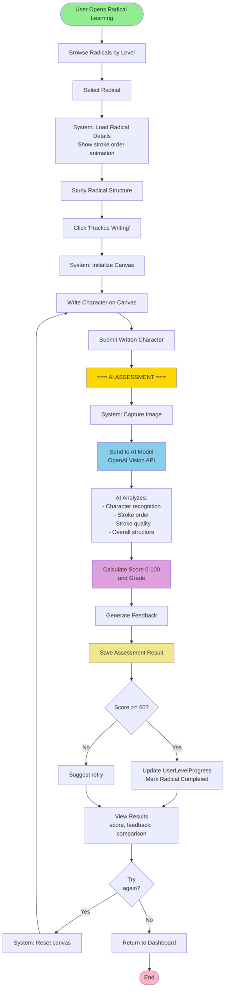

# Activity Diagram - Chinese Learning Platform

## Main Features Activity Flows

### 1. Vocabulary Learning (Học từ vựng)
### 2. Taking Exam (Làm bài thi)
### 3. Radical Character Writing Assessment (Chấm điểm viết Radical)

---

## PlantUML Diagrams

### 1. Vocabulary Learning Flow

### 2. Taking Exam Flow

### 3. Radical Character Writing Assessment Flow

---

## Mermaid Diagrams

### 1. Vocabulary Learning Flow

### 2. Taking Exam Flow

### 3. Radical Character Writing Assessment Flow

---

## Tóm tắt các luồng chính

### 1. Vocabulary Learning (Học từ vựng)
**Luồng chính**: Browse Topics → Select Topic → Study Vocabularies → Mark Completed → Update Progress & Streak

**Điểm chính**:
- Học từ vựng theo chủ đề (Topic-based)
- Lưu từ yêu thích (optional)
- Tự động tính progress % và mastery level
- Cập nhật streak hàng ngày

### 2. Taking Exam (Làm bài thi)
**Luồng chính**: Browse Exams → Select Exam → Start Exam → Answer Questions → Submit → Auto Scoring → View Results

**Điểm chính**:
- Tạo UserExamAttempt khi bắt đầu
- Ghi nhận từng câu trả lời
- Chấm điểm tự động so với correct_answers
- Hiển thị kết quả với explanations (optional)

### 3. Radical Character Writing Assessment (Chấm điểm viết Radical)
**Luồng chính**: Browse Radicals → Select Radical → Study Stroke Order → Write on Canvas → Submit → AI Assessment → View Results

**Điểm chính**:
- Học cấu trúc và thứ tự nét của radical
- Vẽ character trên canvas
- AI phân tích 4 tiêu chí: Recognition, Stroke Order, Quality, Structure
- Chấm điểm 0-100 với detailed feedback
- Cập nhật progress nếu pass (≥60%)

## Notes
- Các sơ đồ đã được rút gọn, tập trung vào luồng chính
- Progress tracking tự động cho cả 3 chức năng
- Mastery levels: beginner (0-39%), intermediate (40-69%), advanced (70-89%), mastered (90-100%)
