# Class Diagram - Chinese Learning Platform

## PlantUML Diagram

```plantuml
@startuml Chinese Learning Platform

' Core User Management
class User {
  + id: int
  + name: string
  + email: string
  + password: string
  + role: enum
  + status: string
  + blocked_at: datetime
  + last_login_at: datetime
  + created_at: datetime
  + updated_at: datetime
  --
  + topicProgress()
  + levelProgress()
  + savedVocabularies()
  + chatHistories()
  + examAttempts()
  + isAdmin(): bool
  + isSuperAdmin(): bool
  + isStaff(): bool
}

' Learning Content
class Level {
  + id: int
  + test_type: string
  + level_number: int
  + level_name: string
  --
  + words()
  + radicals()
  + userProgress()
}

class Word {
  + id: int
  + word: string
  + pinyin: string
  + meaning_vi: string
  + meaning_en: string
  + meaning_ru: string
  + meaning_th: string
  + meaning_ms: string
  + meaning_ko: string
  + meaning_ja: string
  + meaning_id: string
  --
  + level()
  + toJsonFormat()
}

class Radical {
  + id: int
  + hanzi: string
  + traditional: string
  + pinyin: string
  + radical: string
  + stroke_count: int
  + frequency_rank: int
  + general_standard: string
  + meaning: string
  + meaning_vi: string
  + meaning_cn: string
  + meaning_en: string
  + is_favorite: bool
  --
  + level()
  + toJsonFormat()
}

class Topic {
  + id: int
  + name: string
  + name_zh: string
  + description: text
  + image_url: string
  + is_active: boolean
  + sort_order: int
  + level: string
  + created_at: datetime
  + updated_at: datetime
  --
  + vocabularies()
  + userProgress()
}

class Vocabulary {
  + id: int
  + word: string
  + phonetic: string
  + pinyin: string
  + simplified: string
  + traditional: string
  + part_of_speech: string
  + meaning: text
  + meaning_vi: text
  + meaning_zh: text
  + example_sentence: text
  + example_translation: text
  + example_highlight: string
  + definition: text
  + radical_info: string
  + stroke_count: int
  + tone_pattern: string
  + related_words: json
  + similar_chars: json
  + sentences: json
  + pronunciation_audio: string
  + image_url: string
  + level: string
  + created_at: datetime
  + updated_at: datetime
  --
  + topic()
  + savedBy()
}

' User Progress Tracking
class UserLevelProgress {
  + id: int
  + completed_words: int
  + total_words: int
  + completed_radicals: int
  + total_radicals: int
  + mastery_level: enum
  + last_studied_at: datetime
  + created_at: datetime
  + updated_at: datetime
  --
  + user()
  + level()
  + markWordCompleted()
  + markRadicalCompleted()
  + updateMasteryLevel()
  + getProgressPercentageAttribute()
}

class UserTopicProgress {
  + id: int
  + completed_words: int
  + total_words: int
  + mastery_level: enum
  + last_studied_at: datetime
  + created_at: datetime
  + updated_at: datetime
  --
  + user()
  + topic()
  + markWordCompleted()
  + updateMasteryLevel()
  + getProgressPercentageAttribute()
}

class SavedVocabulary {
  + id: int
  + notes: text
  + review_count: int
  + last_reviewed_at: datetime
  + created_at: datetime
  + updated_at: datetime
  --
  + user()
  + vocabulary()
  + markAsReviewed()
}

' Chat & AI Features
class ChatHistory {
  + id: int
  + message: text
  + response: text
  + language: string
  + created_at: datetime
  + updated_at: datetime
  --
  + user()
}

' Exam & Assessment System
class Exam {
  + id: int
  + title: string
  + level: string
  + total_time: int
  + total_score: int
  + is_active: boolean
  + description: text
  + created_at: datetime
  + updated_at: datetime
  --
  + parts()
  + attempts()
}

class ExamPart {
  + id: int
  + name: string
  + part_order: int
  + time: int
  + created_at: datetime
  + updated_at: datetime
  --
  + exam()
  + questionTypes()
}

class QuestionType {
  + id: int
  + kind: string
  + type_order: int
  + instruction: text
  + created_at: datetime
  + updated_at: datetime
  --
  + examPart()
  + questions()
}

class Question {
  + id: int
  + kind: string
  + question_order: int
  + score: int
  + general_text: text
  + general_text_audio: text
  + general_audio: string
  + general_image: string
  + created_at: datetime
  + updated_at: datetime
  --
  + questionType()
  + contents()
}

class QuestionContent {
  + id: int
  + content_order: int
  + question_text: text
  + question_audio: string
  + question_image: string
  + answer_texts: json
  + answer_audios: json
  + answer_images: json
  + correct_answers: json
  + more_correct_answers: json
  + created_at: datetime
  + updated_at: datetime
  --
  + question()
  + userAnswers()
}

class UserExamAttempt {
  + id: int
  + started_at: datetime
  + completed_at: datetime
  + time_spent: int
  + total_score: int
  + max_score: int
  + percentage: decimal
  + status: enum
  + created_at: datetime
  + updated_at: datetime
  --
  + user()
  + exam()
  + answers()
  + calculateScore()
  + complete()
}

class UserAnswer {
  + id: int
  + user_answer: json
  + is_correct: boolean
  + score_earned: int
  + time_spent: int
  + created_at: datetime
  + updated_at: datetime
  --
  + attempt()
  + questionContent()
  + checkCorrect()
}

' Relationships
User "1" -- "0..*" UserTopicProgress : has
User "1" -- "0..*" UserLevelProgress : has
User "1" -- "0..*" SavedVocabulary : saves
User "1" -- "0..*" ChatHistory : chats
User "1" -- "0..*" UserExamAttempt : takes

Level "1" -- "0..*" Word : contains
Level "1" -- "0..*" Radical : contains
Level "1" -- "0..*" UserLevelProgress : tracks

Topic "1" -- "0..*" Vocabulary : contains
Topic "1" -- "0..*" UserTopicProgress : tracks

Vocabulary "1" -- "0..*" SavedVocabulary : saved by

Exam "1" -- "0..*" ExamPart : contains
Exam "1" -- "0..*" UserExamAttempt : taken by

ExamPart "1" -- "0..*" QuestionType : has

QuestionType "1" -- "0..*" Question : contains

Question "1" -- "0..*" QuestionContent : has

QuestionContent "1" -- "0..*" UserAnswer : answered by

UserExamAttempt "1" -- "0..*" UserAnswer : contains

UserTopicProgress "*" -- "1" Topic : tracks
UserLevelProgress "*" -- "1" Level : tracks
SavedVocabulary "*" -- "1" Vocabulary : references

@enduml
```

## Mermaid Diagram

```mermaid
classDiagram
    %% Core User Management
    class User {
        +int id
        +string name
        +string email
        +string password
        +enum role
        +string status
        +datetime blocked_at
        +datetime last_login_at
        +datetime created_at
        +datetime updated_at
        +topicProgress()
        +levelProgress()
        +savedVocabularies()
        +chatHistories()
        +examAttempts()
        +bool isAdmin()
        +bool isSuperAdmin()
        +bool isStaff()
    }

    %% Learning Content - Level System
    class Level {
        +int id
        +string test_type
        +int level_number
        +string level_name
        +words()
        +radicals()
        +userProgress()
    }

    class Word {
        +int id
        +string word
        +string pinyin
        +string meaning_vi
        +string meaning_en
        +string meaning_ru
        +string meaning_th
        +string meaning_ms
        +string meaning_ko
        +string meaning_ja
        +string meaning_id
        +level()
        +toJsonFormat()
    }

    class Radical {
        +int id
        +string hanzi
        +string traditional
        +string pinyin
        +string radical
        +int stroke_count
        +int frequency_rank
        +string general_standard
        +string meaning
        +string meaning_vi
        +string meaning_cn
        +string meaning_en
        +bool is_favorite
        +level()
        +toJsonFormat()
    }

    %% Topic & Vocabulary System
    class Topic {
        +int id
        +string name
        +string name_zh
        +text description
        +string image_url
        +boolean is_active
        +int sort_order
        +string level
        +datetime created_at
        +datetime updated_at
        +vocabularies()
        +userProgress()
    }

    class Vocabulary {
        +int id
        +string word
        +string phonetic
        +string pinyin
        +string simplified
        +string traditional
        +string part_of_speech
        +text meaning
        +text meaning_vi
        +text meaning_zh
        +text example_sentence
        +text example_translation
        +string example_highlight
        +text definition
        +string radical_info
        +int stroke_count
        +string tone_pattern
        +json related_words
        +json similar_chars
        +json sentences
        +string pronunciation_audio
        +string image_url
        +string level
        +datetime created_at
        +datetime updated_at
        +topic()
        +savedBy()
    }

    %% User Progress Tracking
    class UserLevelProgress {
        +int id
        +int completed_words
        +int total_words
        +int completed_radicals
        +int total_radicals
        +enum mastery_level
        +datetime last_studied_at
        +datetime created_at
        +datetime updated_at
        +user()
        +level()
        +markWordCompleted()
        +markRadicalCompleted()
        +updateMasteryLevel()
        +getProgressPercentageAttribute()
    }

    class UserTopicProgress {
        +int id
        +int completed_words
        +int total_words
        +enum mastery_level
        +datetime last_studied_at
        +datetime created_at
        +datetime updated_at
        +user()
        +topic()
        +markWordCompleted()
        +updateMasteryLevel()
        +getProgressPercentageAttribute()
    }

    class SavedVocabulary {
        +int id
        +text notes
        +int review_count
        +datetime last_reviewed_at
        +datetime created_at
        +datetime updated_at
        +user()
        +vocabulary()
        +markAsReviewed()
    }

    %% Chat & AI Features
    class ChatHistory {
        +int id
        +text message
        +text response
        +string language
        +datetime created_at
        +datetime updated_at
        +user()
    }

    %% Exam & Assessment System
    class Exam {
        +int id
        +string title
        +string level
        +int total_time
        +int total_score
        +boolean is_active
        +text description
        +datetime created_at
        +datetime updated_at
        +parts()
        +attempts()
    }

    class ExamPart {
        +int id
        +string name
        +int part_order
        +int time
        +datetime created_at
        +datetime updated_at
        +exam()
        +questionTypes()
    }

    class QuestionType {
        +int id
        +string kind
        +int type_order
        +text instruction
        +datetime created_at
        +datetime updated_at
        +examPart()
        +questions()
    }

    class Question {
        +int id
        +string kind
        +int question_order
        +int score
        +text general_text
        +text general_text_audio
        +string general_audio
        +string general_image
        +datetime created_at
        +datetime updated_at
        +questionType()
        +contents()
    }

    class QuestionContent {
        +int id
        +int content_order
        +text question_text
        +string question_audio
        +string question_image
        +json answer_texts
        +json answer_audios
        +json answer_images
        +json correct_answers
        +json more_correct_answers
        +datetime created_at
        +datetime updated_at
        +question()
        +userAnswers()
    }

    class UserExamAttempt {
        +int id
        +datetime started_at
        +datetime completed_at
        +int time_spent
        +int total_score
        +int max_score
        +decimal percentage
        +enum status
        +datetime created_at
        +datetime updated_at
        +user()
        +exam()
        +answers()
        +calculateScore()
        +complete()
    }

    class UserAnswer {
        +int id
        +json user_answer
        +boolean is_correct
        +int score_earned
        +int time_spent
        +datetime created_at
        +datetime updated_at
        +attempt()
        +questionContent()
        +checkCorrect()
    }

    %% Relationships
    User "1" -- "0..*" UserTopicProgress : has
    User "1" -- "0..*" UserLevelProgress : has
    User "1" -- "0..*" SavedVocabulary : saves
    User "1" -- "0..*" ChatHistory : chats
    User "1" -- "0..*" UserExamAttempt : takes

    Level "1" -- "0..*" Word : contains
    Level "1" -- "0..*" Radical : contains
    Level "1" -- "0..*" UserLevelProgress : tracks

    Topic "1" -- "0..*" Vocabulary : contains
    Topic "1" -- "0..*" UserTopicProgress : tracks

    Vocabulary "1" -- "0..*" SavedVocabulary : saved by

    Exam "1" -- "0..*" ExamPart : contains
    Exam "1" -- "0..*" UserExamAttempt : taken by

    ExamPart "1" -- "0..*" QuestionType : has

    QuestionType "1" -- "0..*" Question : contains

    Question "1" -- "0..*" QuestionContent : has

    QuestionContent "1" -- "0..*" UserAnswer : answered by

    UserExamAttempt "1" -- "0..*" UserAnswer : contains

    UserTopicProgress "*" -- "1" Topic : tracks
    UserLevelProgress "*" -- "1" Level : tracks
    SavedVocabulary "*" -- "1" Vocabulary : references
```

## Tổng quan hệ thống

### 1. **User Management (Quản lý người dùng)**
- `User`: Người dùng với các vai trò (admin, super_admin, staff, user)

### 2. **Level System (Hệ thống cấp độ)**
- `Level`: Cấp độ HSK (HSK 1-6)
- `Word`: Từ vựng theo cấp độ với đa ngôn ngữ
- `Radical`: Bộ thủ Hán tự với đa ngôn ngữ

### 3. **Topic & Vocabulary (Chủ đề & Từ vựng)**
- `Topic`: Chủ đề học tập
- `Vocabulary`: Từ vựng chi tiết trong chủ đề

### 4. **User Progress (Tiến độ học tập)**
- `UserTopicProgress`: Theo dõi tiến độ học theo chủ đề (Topic-based learning)
- `UserLevelProgress`: Theo dõi tiến độ học theo cấp độ HSK (Level-based learning)
- `SavedVocabulary`: Từ vựng đã lưu của người dùng

### 5. **AI Chat (Chat AI)**
- `ChatHistory`: Lịch sử chat với AI

### 6. **Exam & Assessment System (Hệ thống thi & Đánh giá)**
- `Exam`: Bài thi HSK (HSK 1-6)
- `ExamPart`: Phần thi (Listening, Reading, Writing)
- `QuestionType`: Loại câu hỏi (110001, 110002, etc.)
- `Question`: Câu hỏi với general section
- `QuestionContent`: Nội dung câu hỏi chi tiết với đáp án
- `UserExamAttempt`: Lượt thi của user
- `UserAnswer`: Câu trả lời của user

## Các mối quan hệ chính

1. **User** có nhiều:
   - UserTopicProgress (tiến độ học theo chủ đề)
   - UserLevelProgress (tiến độ học theo cấp độ HSK)
   - SavedVocabulary (từ vựng đã lưu)
   - ChatHistory (lịch sử chat)
   - UserExamAttempt (lượt thi)

2. **Level** chứa:
   - Words (từ vựng)
   - Radicals (bộ thủ)
   - UserLevelProgress (tiến độ của users)

3. **Topic** có:
   - Vocabularies (từ vựng)
   - UserTopicProgress (tiến độ của users)

4. **Vocabulary** có:
   - SavedVocabulary (được lưu bởi users)

5. **Exam** (Hệ thống phân cấp):
   - Exam → ExamParts → QuestionTypes → Questions → QuestionContents
   - UserExamAttempt chứa: UserAnswers (câu trả lời của user)
