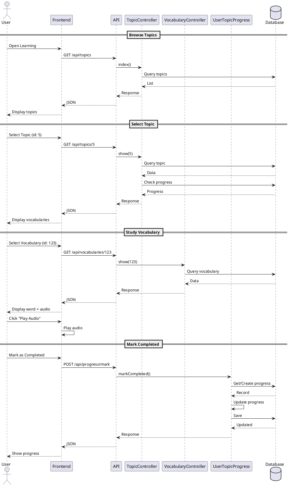
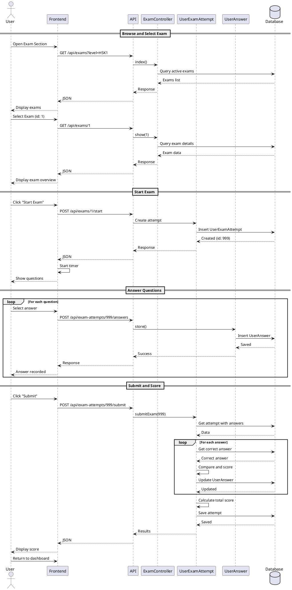
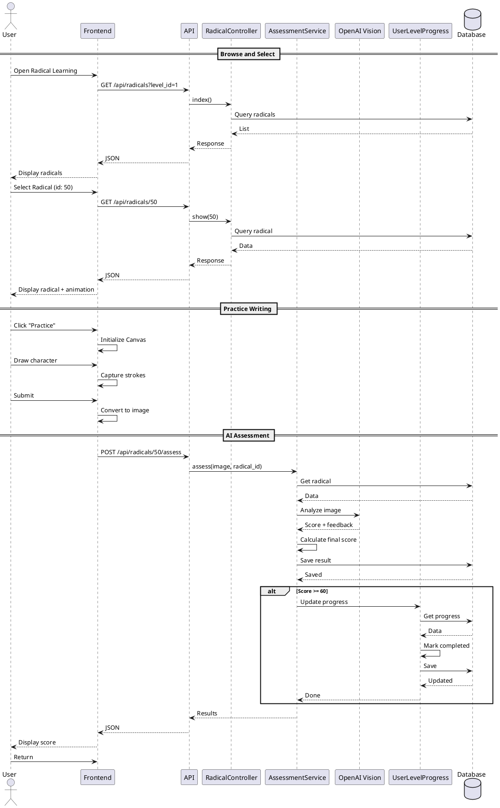
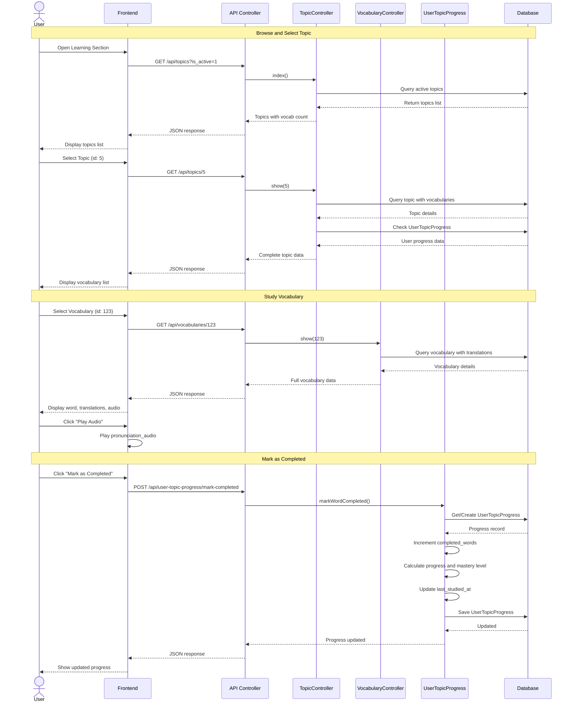
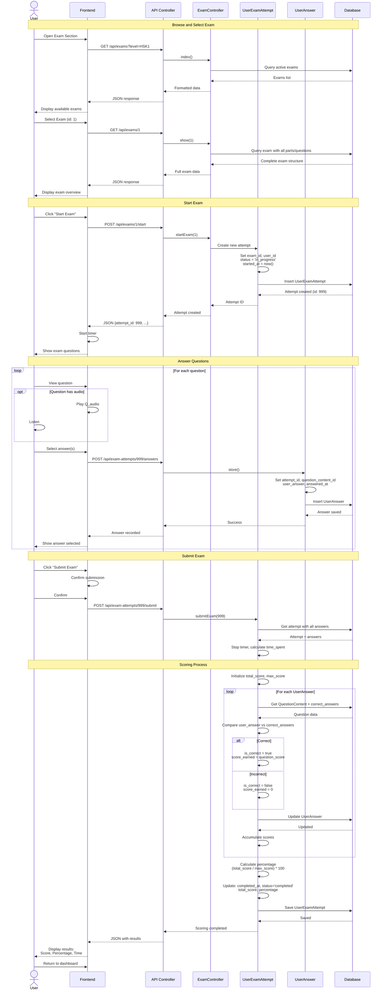
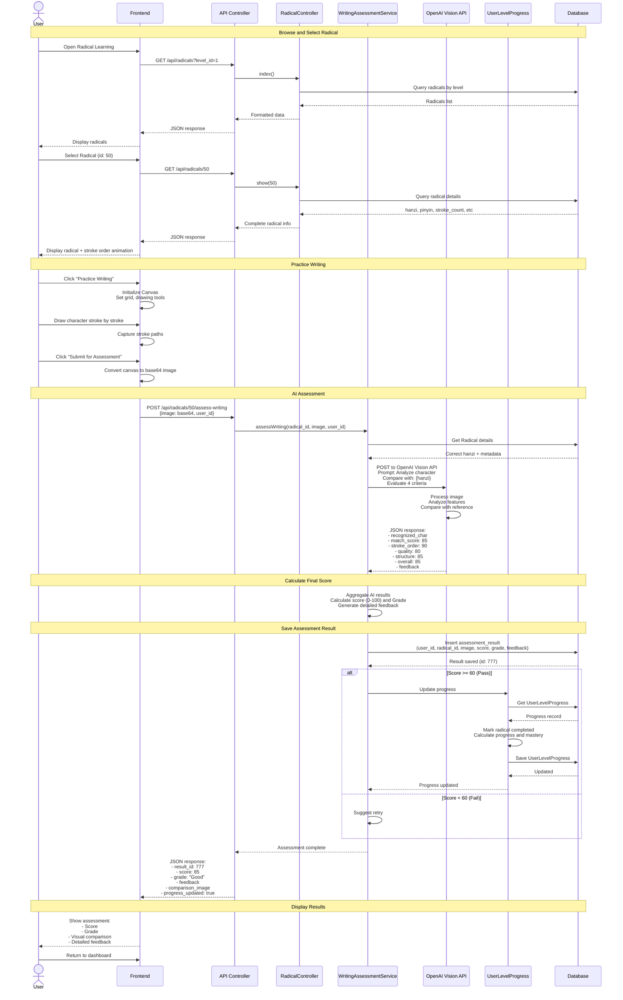

# Sequence Diagram - Chinese Learning Platform

## Main Features Sequence Flows

### 1. Vocabulary Learning (Học từ vựng)
### 2. Taking Exam (Làm bài thi)
### 3. Radical Character Writing Assessment (Chấm điểm viết Radical)

---

## PlantUML Diagrams

### 1. Vocabulary Learning Sequence

### 2. Taking Exam Sequence

### 3. Radical Character Writing Assessment Sequence

---

## Mermaid Diagrams

### 1. Vocabulary Learning Sequence

### 2. Taking Exam Sequence

### 3. Radical Character Writing Assessment Sequence

---

## Giải thích Sequence Diagrams

### 1. Vocabulary Learning Sequence
**Actors/Components:**
- User → Frontend → API → Controllers (Topic, Vocabulary, UserTopicProgress, SavedVocabulary, UserStreak) → Database

**Key Flows:**
1. **Browse Topics**: User requests topics → System queries active topics → Returns with vocabulary counts
2. **Study Vocabulary**: Select vocab → Load details with translations → Play audio → Save to favorites (optional)
3. **Mark Completed**: Update UserTopicProgress → Calculate progress % → Determine mastery level
4. **Review Saved**: Load saved vocabularies → Review → Update review_count
5. **Update Streak**: Check-in → Validate consecutive days → Update streak_count → Save weekly data

**Database Operations:**
- Query: topics, vocabularies, translations, user progress
- Insert: saved_vocabulary records
- Update: UserTopicProgress (progress, mastery), UserStreak (streak data)

### 2. Taking Exam Sequence
**Actors/Components:**
- User → Frontend → API → ExamController → UserExamAttempt → UserAnswer → Database

**Key Flows:**
1. **Browse Exams**: Filter by level → Query active exams → Return with parts/questions count
2. **Start Exam**: Create UserExamAttempt → Set status='in_progress' → Start timer
3. **Answer Questions**: Loop through questions → For each: Display → User answers → Save UserAnswer
4. **Submit Exam**: Stop timer → Calculate time_spent
5. **Scoring**: Loop through answers → Compare with correct_answers → Calculate is_correct and score_earned → Accumulate total_score → Calculate percentage
6. **View Results**: Show score summary → Optionally view detailed results with explanations

**Database Operations:**
- Query: exams, exam_parts, questions, question_contents, correct_answers
- Insert: UserExamAttempt, UserAnswer records
- Update: UserAnswer (is_correct, score_earned), UserExamAttempt (completed_at, status, scores)

### 3. Radical Writing Assessment Sequence
**Actors/Components:**
- User → Frontend → API → RadicalController → WritingAssessmentService → OpenAI Vision API → UserLevelProgress → Database

**Key Flows:**
1. **Browse Radicals**: Filter by HSK level → Query radicals → Display with details
2. **Practice Writing**: Initialize canvas → User draws character → Capture strokes → Allow redo
3. **Submit for Assessment**: Convert canvas to base64 image → Send to backend
4. **AI Assessment**: 
   - Send image + prompt to OpenAI Vision API
   - AI analyzes 4 criteria: Recognition, Stroke Order, Quality, Structure
   - Returns scores and feedback
5. **Calculate Final Score**: Aggregate AI results → Determine grade (Excellent/Good/Fair/Needs Improvement)
6. **Generate Feedback**: Create detailed feedback with specific improvement suggestions
7. **Save Result**: Store assessment_result with image, score, grade, feedback
8. **Update Progress**: If pass (≥60%) → Mark radical completed → Update UserLevelProgress → Calculate mastery level
9. **Display Results**: Show visual comparison (user's vs correct) → Detailed feedback → Scores breakdown

**External Service:**
- **OpenAI Vision API**: Analyzes handwritten character image, provides recognition and quality assessment

**Database Operations:**
- Query: radicals (by level), UserLevelProgress
- Insert: assessment_result record
- Update: UserLevelProgress (completed_radicals, progress %, mastery_level)

---

## Key Patterns in All Sequences

### 1. **Request-Response Flow**
- User action → Frontend → API → Controller → Service/Model → Database → Response chain

### 2. **Progress Tracking**
- All 3 features update user progress automatically
- Calculate completion percentage
- Determine mastery level based on thresholds

### 3. **Multi-language Support**
- Translations loaded from separate translation tables
- User's preferred language determines which translation is shown

### 4. **Validation & Error Handling**
- Check permissions (is_active, user authentication)
- Validate data before processing
- Return appropriate error responses

### 5. **Timestamps**
- Record action timestamps (answered_at, last_studied_at, completed_at)
- Track time spent on activities

### 6. **Scoring Logic**
- Vocabulary: Binary (completed or not)
- Exam: Compare answers, calculate score/percentage
- Radical Writing: AI-based scoring with multiple criteria (0-100 scale)
